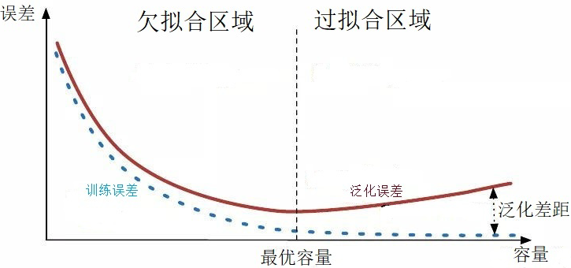
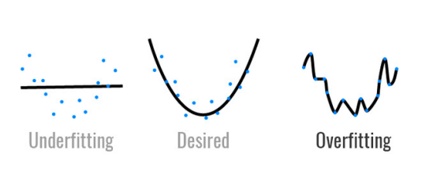

## 2023年8月16日

#### 一、训练集

这个是最好理解的，用来训练模型内参数的数据集，分类器直接根据训练集来调整自身获得更好的分类效果

#### 二、验证集

用于在训练过程中检验模型的状态，收敛情况。验证集通常用于调整超参数，根据几组模型验证集上的表现决定哪组超参数拥有最好的性能。

同时验证集在训练过程中还可以用来监控模型是否发生过拟合，一般来说验证集表现稳定后，若继续训练，训练集表现还会继续上升，但是验证集会出现不升反降的情况，这样一般就发生了过拟合。所以验证集也用来判断何时停止训练

#### 三、测试集😎

测试集用来评价模型泛化能力，即之前模型使用验证集确定了超参数，使用训练集调整了参数，最后使用一个从没有见过的数据集来判断这个模型是否Work。

#### 四、训练误差与泛化误差

机器学习在训练数据集上表现出的误差叫做训练误差，在任意一个测试数据样本上的误差的期望值叫做泛化误差。

#### 五、欠拟合和过拟合

##### 	什么是欠拟合？

欠拟合是指模型不能在训练集上获得足够低的误差。换句换说，就是模型复杂度低，模型在训练集上就表现很差，没法学习到数据背后的规律。

##### 	如何解决欠拟合？

欠拟合基本上都会发生在训练刚开始的时候，经过不断训练之后欠拟合应该不怎么考虑了。但是如果真的还是存在的话，可以通过**增加网络复杂度**或者在模型中**增加特征**，这些都是很好解决欠拟合的方法。

##### 	什么是过拟合？

过拟合是指训练误差和测试误差之间的差距太大。换句换说，就是模型复杂度高于实际问题，**模型在训练集上表现很好，但在测试集上却表现很差**。模型对训练集"死记硬背"（记住了不适用于测试集的训练集性质或特点），没有理解数据背后的规律，**泛化能力差**。

<center>
    
    <br>
    <div style="color:orange; border-bottom: 1px solid #d9d9d9;
    display: inline-block;
    color: #999;
    padding: 2px;">模型容量与拟合程度之间关系</div>
</center>

<center>
    
    <br>
    <div style="color:orange; border-bottom: 1px solid #d9d9d9;
    display: inline-block;
    color: #999;
    padding: 2px;">欠拟合与过拟合</div>
</center>


训练刚开始的时候，模型还在学习过程中训练误差和测试误差较大，处于欠拟合区域。随着训练的进行，训练误差和测试误差都下降。在到达一个临界点之后，训练集的误差下降，测试集的误差却上升了，这个时候就进入了过拟合区域——由于训练出来的网络**过度拟合了训练集**，对训练集以外的数据却不work。

可以在损失函数处加上正则化$L1$范数或$L2$范数.

## 2023年8月17日

#### 一、为什么需要激活函数？

如果不使用激活函数，我们的每一层输出只是承接了上一层输入函数的线性变换，无论神经网络有多少层，输出都是输入的线性组合。 如果使用的话，**激活函数给神经元引入了非线性的因素，使得神经网络可以逼近任何非线性函数，这样神经网络就可以应用到非线性模型中**。

## 2023年8月18日

#### 一、 什么是观测误差

[实验](https://zh.wikipedia.org/wiki/实验)[科学](https://zh.wikipedia.org/wiki/科学)中，**测量误差**（英语：measurement error）或**观测误差**（observational error）简称**误差**（error），是[测量](https://zh.wikipedia.org/wiki/测量)结果偏离[真值](https://zh.wikipedia.org/wiki/真值)的程度。对任何一个物理量进行的测量都不可能得出一个绝对准确的数值，即使使用测量技术所能达到的最完善的方法，测出的数值也和真实值存在差异，这种测量值和真实值的差异称为误差。误差根据数值计算方式可分为绝对误差和相对误差，也可以根据误差来源分为系统误差、随机误差和毛误差。

测量误差（除了毛误差外）并不是“错误”，是事物固有的不确定性因素在量测时的体现。

## 2023年9月1日

#### 一、独热（One-Hot）编码

One-Hot编码，又称为一位有效编码，主要是采用N位状态寄存器来对N个状态进行编码，每个状态都由他独立的寄存器位，并且在任意时候只有一位有效。

One-Hot编码是分类变量作为二进制向量的表示。这首先要求将分类值映射到整数值。然后，每个整数值被表示为二进制向量，除了整数的索引之外，它都是零值，它被标记为1。

听概念的话显得比较复杂，我们来看一个例子。

假设我们有一群学生，他们可以通过四个特征来形容，分别是：

-   性别：[“男”，“女”]
-   年级：[“初一”，“初二”，“初三”]
-   学校：[“一中”，“二中”，“三中”，“四中”]

举个例子，用上述四个特征来描述小明同学，即“男生，初一，来自二中”，如果特征类别是有序的话，我们能够用表示顺序的数组表示

即“男生，初一，来自一中”   ==>   [0,0,1]

但是这样的特征处理并不能直接放入机器学习算法中，因为类别之间是无序的。

这时候就可以用独热编码的形式来表示了，我们用采用N位状态寄存器来对N个状态进行编码，拿上面的例子来说，就是：

| 性别 | [“男”，“女”]                     | N=2  | 男：1 0 女：0 1                                      |
| :--- | :------------------------------- | :--- | :--------------------------------------------------- |
| 年级 | [“初一”，“初二”，“初三”]         | N=3  | 初一：1 0 0  初二：0 1 0初三：0 0 1                  |
| 学校 | [“一中”，“二中”，“三中”，“四中”] | N=4  | 一中：1 0 0 0二中：0 1 0 0三中：0 0 1 0四中：0 0 0 1 |

因此，当我们再来描述小明的时候，就可以采用 [1 0 1 0 0 0 1 0 0] 


在很多机器学习任务中，特征并不总是连续值，而有可能是分类值。

离散特征的编码分为两种情况：

-   离散特征的取值之间没有大小的意义，比如$color：[red,blue]$,那么就使用one-hot编码

-   离散特征的取值有大小的意义，比如$size:[X,XL,XXL]$, 那么就使用数值的映射${X:1,XL:2,XXL:3}$

#### 二、关于python中数据类型的shape属性

```python
import cv2 as cv

bgr_img = cv.imread("/img_path", cv.IMREAD_COLOR)
print (bgr_img.shape)
```


**该段代码的输出将会是图片的行数+列数+通道数**

#### 三、zero-mean normalization, z-score标准化

设随机变量$X$具有数学期望$E(X)=\mu$, 方差$D(x)=\alpha^2 \neq 0$. 记$X^*=\frac{X-\mu}{\sigma}$, 叫做随机变量$X$的标准初始化. 将随机变量的期望化为0, 方差化为1. 证明:

$$
E(X^*)=\frac{1}{\sigma}E(X-\mu)=\frac{1}{\sigma}(E(X)-\mu)=0 \label{1}
$$

$$
D(X^*)=E(X^{*2})-E(X^*)^2=E(\frac{X-\mu}{\sigma})^2=\frac{1}{\sigma^2}E(X-\mu)^2=\frac{\sigma^2}{\sigma^2}=1 \label{2}
$$

#### 四、 深度学习中Epoch、Batch以及Batch size的设定🚀

- **Epoch（时期）：**

当一个完整的数据集通过了神经网络一次并且返回了一次，这个过程称为一次>epoch。（也就是说，所有训练样本在神经网络中都 进行了一次正向传播 和一次反向传播 ）

再通俗一点，一个Epoch就是将所有训练样本训练一次的过程。

然而，当一个Epoch的样本（也就是所有的训练样本）数量可能太过庞大（对于计算机而言），就需要把它分成多个小块，也就是就是分成多个Batch 来进行训练。

-   **Batch（批 / 一批样本）：**

将整个训练样本分成若干个Batch。

-   **Batch_Size（批大小）：**

每批样本的大小。

-   **Iteration（一次迭代）：**

训练一个Batch就是一次Iteration（这个概念跟程序语言中的迭代器相似）

-   **为什么要使用多于一个epoch?**

在神经网络中传递完整的数据集一次是不够的，而且我们需要将完整的数据集在同样的神经网络中传递多次。但请记住，我们使用的是有限的数据集，并且我们使用一个迭代过程即梯度下降来优化学习过程。如下图所示。因此仅仅更新一次或者说使用一个epoch是不够的。


### 2023年9月2日

#### 一关于python中的shape属性（补充）

```python
import numpy as np

a = np.array([1, 2, 3])
a.shape # (3,)

a = np.array([[1, 2, 3]])
a.shape # (1, 3)
```

