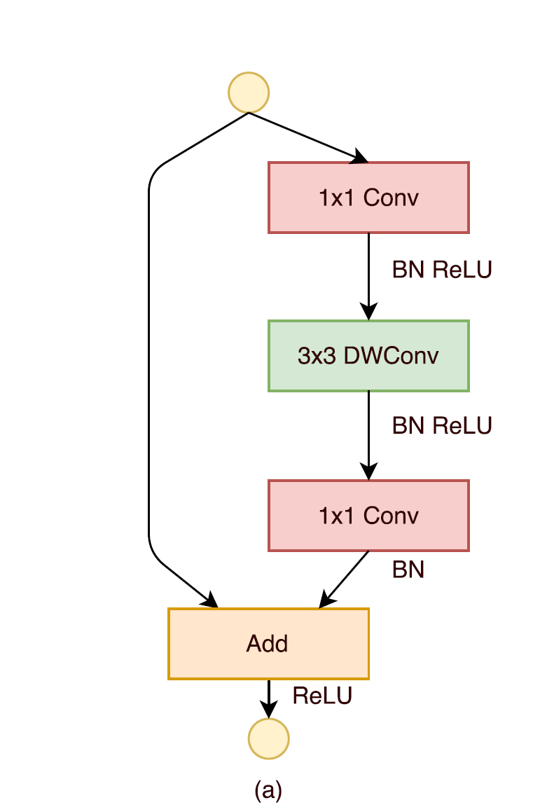

<center class="half">
    
</center>


## 2023年8月16日

### 一、训练集

这个是最好理解的，用来训练模型内参数的数据集，分类器直接根据训练集来调整自身获得更好的分类效果

### 二、验证集

用于在训练过程中检验模型的状态，收敛情况。验证集通常用于调整超参数，根据几组模型验证集上的表现决定哪组超参数拥有最好的性能。

同时验证集在训练过程中还可以用来监控模型是否发生过拟合，一般来说验证集表现稳定后，若继续训练，训练集表现还会继续上升，但是验证集会出现不升反降的情况，这样一般就发生了过拟合。所以验证集也用来判断何时停止训练

### 三、测试集😎

测试集用来评价模型泛化能力，即之前模型使用验证集确定了超参数，使用训练集调整了参数，最后使用一个从没有见过的数据集来判断这个模型是否Work。

### 四、训练误差与泛化误差

机器学习在训练数据集上表现出的误差叫做训练误差，在任意一个测试数据样本上的误差的期望值叫做泛化误差。

### 五、欠拟合和过拟合

##### 	什么是欠拟合？

欠拟合是指模型不能在训练集上获得足够低的误差。换句换说，就是模型复杂度低，模型在训练集上就表现很差，没法学习到数据背后的规律。

##### 	如何解决欠拟合？

欠拟合基本上都会发生在训练刚开始的时候，经过不断训练之后欠拟合应该不怎么考虑了。但是如果真的还是存在的话，可以通过**增加网络复杂度**或者在模型中**增加特征**，这些都是很好解决欠拟合的方法。

##### 	什么是过拟合？

过拟合是指训练误差和测试误差之间的差距太大。换句换说，就是模型复杂度高于实际问题，**模型在训练集上表现很好，但在测试集上却表现很差**。模型对训练集"死记硬背"（记住了不适用于测试集的训练集性质或特点），没有理解数据背后的规律，**泛化能力差**。

<center>
    
    <br>
    <div style="color:orange; border-bottom: 1px solid #d9d9d9;
    display: inline-block;
    color: #999;
    padding: 2px;">模型容量与拟合程度之间关系</div>
</center>

<center>
    
    <br>
    <div style="color:orange; border-bottom: 1px solid #d9d9d9;
    display: inline-block;
    color: #999;
    padding: 2px;">欠拟合与过拟合</div>
</center>


训练刚开始的时候，模型还在学习过程中训练误差和测试误差较大，处于欠拟合区域。随着训练的进行，训练误差和测试误差都下降。在到达一个临界点之后，训练集的误差下降，测试集的误差却上升了，这个时候就进入了过拟合区域——由于训练出来的网络**过度拟合了训练集**，对训练集以外的数据却不work。

可以在损失函数处加上正则化$L1$范数或$L2$范数.

## 2023年8月17日

### 一、为什么需要激活函数？

如果不使用激活函数，我们的每一层输出只是承接了上一层输入函数的线性变换，无论神经网络有多少层，输出都是输入的线性组合。 如果使用的话，**激活函数给神经元引入了非线性的因素，使得神经网络可以逼近任何非线性函数，这样神经网络就可以应用到非线性模型中**。

## 2023年8月18日

### 一、 什么是观测误差

[实验](https://zh.wikipedia.org/wiki/实验)[科学](https://zh.wikipedia.org/wiki/科学)中，**测量误差**（英语：measurement error）或**观测误差**（observational error）简称**误差**（error），是[测量](https://zh.wikipedia.org/wiki/测量)结果偏离[真值](https://zh.wikipedia.org/wiki/真值)的程度。对任何一个物理量进行的测量都不可能得出一个绝对准确的数值，即使使用测量技术所能达到的最完善的方法，测出的数值也和真实值存在差异，这种测量值和真实值的差异称为误差。误差根据数值计算方式可分为绝对误差和相对误差，也可以根据误差来源分为系统误差、随机误差和毛误差。

测量误差（除了毛误差外）并不是“错误”，是事物固有的不确定性因素在量测时的体现。

## 2023年9月1日

### 一、独热（One-Hot）编码

One-Hot编码，又称为一位有效编码，主要是采用N位状态寄存器来对N个状态进行编码，每个状态都由他独立的寄存器位，并且在任意时候只有一位有效。

One-Hot编码是分类变量作为二进制向量的表示。这首先要求将分类值映射到整数值。然后，每个整数值被表示为二进制向量，除了整数的索引之外，它都是零值，它被标记为1。

听概念的话显得比较复杂，我们来看一个例子。

假设我们有一群学生，他们可以通过四个特征来形容，分别是：

-   性别：[“男”，“女”]
-   年级：[“初一”，“初二”，“初三”]
-   学校：[“一中”，“二中”，“三中”，“四中”]

举个例子，用上述四个特征来描述小明同学，即“男生，初一，来自二中”，如果特征类别是有序的话，我们能够用表示顺序的数组表示

即“男生，初一，来自一中”   ==>   [0,0,1]

但是这样的特征处理并不能直接放入机器学习算法中，因为类别之间是无序的。

这时候就可以用独热编码的形式来表示了，我们用采用N位状态寄存器来对N个状态进行编码，拿上面的例子来说，就是：

| 性别 | [“男”，“女”]                     | N=2  | 男：1 0 女：0 1                                      |
| :--- | :------------------------------- | :--- | :--------------------------------------------------- |
| 年级 | [“初一”，“初二”，“初三”]         | N=3  | 初一：1 0 0  初二：0 1 0初三：0 0 1                  |
| 学校 | [“一中”，“二中”，“三中”，“四中”] | N=4  | 一中：1 0 0 0二中：0 1 0 0三中：0 0 1 0四中：0 0 0 1 |

因此，当我们再来描述小明的时候，就可以采用 [1 0 1 0 0 0 1 0 0] 


在很多机器学习任务中，特征并不总是连续值，而有可能是分类值。

离散特征的编码分为两种情况：

-   离散特征的取值之间没有大小的意义，比如$color：[red,blue]$,那么就使用one-hot编码

-   离散特征的取值有大小的意义，比如$size:[X,XL,XXL]$, 那么就使用数值的映射${X:1,XL:2,XXL:3}$

### 二、关于python中数据类型的shape属性

```python
import cv2 as cv

bgr_img = cv.imread("/img_path", cv.IMREAD_COLOR)
print (bgr_img.shape)
```


**该段代码的输出将会是图片的行数+列数+通道数**

### 三、zero-mean normalization, z-score标准化

设随机变量$X$具有数学期望$E(X)=\mu$, 方差$D(x)=\alpha^2 \neq 0$. 记$X^*=\frac{X-\mu}{\sigma}$, 叫做随机变量$X$的标准初始化. 将随机变量的期望化为0, 方差化为1. 证明:

$$
E(X^*)=\frac{1}{\sigma}E(X-\mu)=\frac{1}{\sigma}(E(X)-\mu)=0 \label{1}
$$

$$
D(X^*)=E(X^{*2}) - E(X^*)^2 = E(\frac{X-\mu}{\sigma})^2 = \frac{1}{\sigma^2} E(X-\mu)^2 = \frac{\sigma^2}{\sigma^2} = 1 \label{2}
$$

### 四、 深度学习中Epoch、Batch以及Batch size的设定🚀

- **Epoch（时期）：**

当一个完整的数据集通过了神经网络一次并且返回了一次，这个过程称为一次>epoch。（也就是说，所有训练样本在神经网络中都 进行了一次正向传播 和一次反向传播 ）

再通俗一点，一个Epoch就是将所有训练样本训练一次的过程。

然而，当一个Epoch的样本（也就是所有的训练样本）数量可能太过庞大（对于计算机而言），就需要把它分成多个小块，也就是就是分成多个Batch 来进行训练。

-   **Batch（批 / 一批样本）：**

将整个训练样本分成若干个Batch。

-   **Batch_Size（批大小）：**

每批样本的大小。

-   **Iteration（一次迭代）：**

训练一个Batch就是一次Iteration（这个概念跟程序语言中的迭代器相似）

-   **为什么要使用多于一个epoch?**

在神经网络中传递完整的数据集一次是不够的，而且我们需要将完整的数据集在同样的神经网络中传递多次。但请记住，我们使用的是有限的数据集，并且我们使用一个迭代过程即梯度下降来优化学习过程。如下图所示。因此仅仅更新一次或者说使用一个epoch是不够的。


## 2023年9月2日

### 一、关于python中的shape属性（补充）

```python
import numpy as np

a = np.array([1, 2, 3])
a.shape # (3,)

a = np.array([[1, 2, 3]])
a.shape # (1, 3)
```

## 2023年9月4日

### 一、csv文件的数据读取并查看数据结构之间关系

```python
import pandas as pd
import matplotlib.pyplot as plt

data = pd.concat([train_df['Sold Price'], train_df['Listed Price']], axis=1)
fig = plt.scatter(data, x='Listed Price', y='Sold Price')
fig.show()
```

### 二、csv文件中查看某一类数据的值分布

```python
import seaborn as sns
import matplotlib.pyplot as plt

# 假设 train_data 是一个包含 "SalePrice" 列的 DataFrame

# 绘制 SalePrice 列的直方图
sns.displot(train_data["SalePrice"], kde=True)  # 使用 kde=True 添加核密度估计曲线
plt.title('Distribution of SalePrice')
plt.xlabel('SalePrice')
plt.ylabel('Frequency')
plt.show()
```

## 2023年9月6日

### 一、图像卷积后的输出形状

#### 1.直接卷积

<center class="half">
    
    
</center>

-   输入$\pmb{X}: n_h \times n_w$
-   卷积核 $\pmb{W}: k_h \times k_w$
-   偏差$b \in \mathbb{R}$
-   输出$\pmb{Y}:(n_h-k_h+1) \times(n_w-k_w+1)$

#### 2.填充卷积

<center class="half">
    
    
</center>

-   高度(行)填充$p_h$, 宽度(列)填充$p_w$
-   输出$\pmb{Y}:(n_h-k_h+p_h+1) \times(n_w-k_w+p_w+1)$

#### 3.步幅

<center class="half">
    
    
</center>

-   高度(行)步幅$s_h$, 宽度(列)步幅$s_w$
-   输出$\pmb{Y}:\frac{n_h-k_h+p_h+s_h}{s_h} \times\frac{n_w-k_w+p_w+s_w}{s_w}$（向下取整）

#### 4.感受野(Receptive Field, RF)大小

$S_i = \Pi^i_{i-1}Stride_i$ 其中$S_i$表示之前所有层的步长的乘积(不包括本层)

$RF_{i+1} = RF_i + (k - 1) * S_i$ 其中$k$为卷积核大小, $RF_i$为上一层的感受野大小, $RF_{i+1}$表示当前层感受野大小.

## 2023年9月7日

### 一、经典的点扩散函数估计 (我用不起来)

在曝光时间$T$内匀速直线运动位移量为$R$, 沿水平轴成$\theta$角变化, 则点扩散函数的频谱形式为:
$$
H(u, v) = \frac{T\sin[\pi(uR\cos{\theta} + vR\sin{\theta})]}{\pi(uR\cos{\theta}+vR\sin{\theta})}\exp{(-j\pi(uR\cos{\theta}+vR\sin{\theta}))}
$$

### 二、torch的Tensor数据类型的形状

```python
>>>import torch
>>>x = torch.rand((8, 8))
>>>x
tensor([[1., 1., 1., 1., 1., 1., 1., 1.],
        [1., 1., 1., 1., 1., 1., 1., 1.],
        [1., 1., 1., 1., 1., 1., 1., 1.],
        [1., 1., 1., 1., 1., 1., 1., 1.],
        [1., 1., 1., 1., 1., 1., 1., 1.],
        [1., 1., 1., 1., 1., 1., 1., 1.],
        [1., 1., 1., 1., 1., 1., 1., 1.],
        [1., 1., 1., 1., 1., 1., 1., 1.]])
>>>x.shape
torch.Size([8, 8])
>>>(1, 1) + x.shape
(1, 1, 8, 8)
>>>x = x.reshape((1, 1) + x.shape) #此处的意思为将x reshape 成输出通道数为1, 输入通道为1再加x.shape的shape. 
# 此外, 该句等价于x = x.reshape((1, 1, x.shape[0], x.shape[1]))
>>>x.shape
torch.Size([1, 1, 8, 8])
```

### 三、多个输入输出通道

#### 1.多输入通道


-   输入 $\pmb{X}: c_i \times n_h \times n_w$
-   核 $\pmb{W}: c_i \times k_h \times k_w$
-   输出 $\pmb{Y}: m_h \times m_w$


#### 2.多输出通道

-   输入$\pmb{X}: c_i \times n_h \times n_w$
-   核$\pmb{W}: c_0 \times c_i \times k_h \times k_w$
-   输出$\pmb{Y}: c_0 \times m_h \times m_w$

## 2023年9月11日

### 一、池化层

-   池化层解决卷积对位置敏感的问题，所以经过单（多）个卷积层后都要进行池化层操作；
-   经过池化层后输入通道等于输出通道；
-   经过池化层后的图像大小和过卷积层后的结果一致：$\pmb{shape}:\frac{n_h-k_h+p_h+s_h}{s_h} \times\frac{n_w-k_w+p_w+s_w}{s_w}$
-   实际上池化层中默认stride为池化层的核大小，在代码中可以指定stride.

```python
import torch 
from torch import nn

input = torch.tensor([[[[1, 3, 2, 1],
                       	[2, 9, 1, 1],
                       	[1, 3, 2, 3],
                       	[5, 6, 1, 2]]]], dtype=torch.float32)

net = nn.MaxPool2d(kernel_size=3, padding=1)

net(input).shape

#输出torch.Size([1, 1, 2, 2])
```


### 二、卷积神经网络（LeNet）


```python
net = nn.Sequential(nn.Conv2d(1, 6, kernel_size=5, padding=2), nn.Sigmoid(),
                    nn.AvgPool2d(kernel_size=2, stride=2),
                    nn.Conv2d(6, 16, kernel_size=5), nn.Sigmoid(),
                    nn.AvgPool2d(kernel_size=2, stride=2),
                    nn.Flatten(),
                    nn.Linear(16 * 5 * 5, 120), nn.Sigmoid(),
                    nn.Linear(120, 84), nn.Sigmoid(),
                    nn.Linear(84, 10))
                    
X = torch.rand(size=(1, 1, 28, 28), dtype=torch.float32)
for layer in net:
    X = layer(X)
    print(layer.__class__.__name__,'output shape: \t',X.shape)

# 输出为：
# Conv2d output shape: 	 	 torch.Size([1, 6, 28, 28])
# Sigmoid output shape: 	 torch.Size([1, 6, 28, 28])
# AvgPool2d output shape: 	 torch.Size([1, 6, 14, 14])
# Conv2d output shape: 	 	 torch.Size([1, 16, 10, 10])
# Sigmoid output shape: 	 torch.Size([1, 16, 10, 10])
# AvgPool2d output shape: 	 torch.Size([1, 16, 5, 5])
# Flatten output shape: 	 torch.Size([1, 400])
# Linear output shape: 	 	 torch.Size([1, 120])
# Sigmoid output shape: 	 torch.Size([1, 120])
# Linear output shape: 	 	 torch.Size([1, 84])
# Sigmoid output shape: 	 torch.Size([1, 84])
# Linear output shape: 	 	 torch.Size([1, 10])

```

### 三、AlexNet（记得看论文）


```python
net = nn.Sequential(
    nn.Conv2d(1, 96, kernel_size=11, stride=4, padding=1), nn.ReLU(),
    nn.MaxPool2d(kernel_size=3, stride=2),
    nn.Conv2d(96, 256, kernel_size=5, padding=2), nn.ReLU(),
    nn.MaxPool2d(kernel_size=3, stride=2),
    nn.Conv2d(256, 384, kernel_size=3, padding=1), nn.ReLU(),
    nn.Conv2d(384, 384, kernel_size=3, padding=1), nn.ReLU(),
    nn.Conv2d(384, 256, kernel_size=3, padding=1), nn.ReLU(),
    nn.MaxPool2d(kernel_size=3, stride=2),
    nn.Flatten(),
    nn.Linear(6400, 4096), nn.ReLU(),
    nn.Dropout(p=0.5), # 全连接层防止过拟合
    nn.Linear(4096, 4096), nn.ReLU(),
    nn.Dropout(p=0.5),
    nn.Linear(4096, 10))

X = torch.randn(1, 1, 224, 224)
for layer in net:
    X=layer(X)
    print(layer.__class__.__name__,'output shape:\t',X.shape)
    
# 输出为：    
# Conv2d output shape:	 torch.Size([1, 96, 54, 54])
# ReLU output shape:	 torch.Size([1, 96, 54, 54])
# MaxPool2d output shape:	 torch.Size([1, 96, 26, 26])
# Conv2d output shape:	 torch.Size([1, 256, 26, 26])
# ReLU output shape:	 torch.Size([1, 256, 26, 26])
# MaxPool2d output shape:	 torch.Size([1, 256, 12, 12])
# Conv2d output shape:	 torch.Size([1, 384, 12, 12])
# ReLU output shape:	 torch.Size([1, 384, 12, 12])
# Conv2d output shape:	 torch.Size([1, 384, 12, 12])
# ReLU output shape:	 torch.Size([1, 384, 12, 12])
# Conv2d output shape:	 torch.Size([1, 256, 12, 12])
# ReLU output shape:	 torch.Size([1, 256, 12, 12])
# MaxPool2d output shape:	 torch.Size([1, 256, 5, 5])
# Flatten output shape:	 torch.Size([1, 6400])
# Linear output shape:	 torch.Size([1, 4096])
# ReLU output shape:	 torch.Size([1, 4096])
# Dropout output shape:	 torch.Size([1, 4096])
# Linear output shape:	 torch.Size([1, 4096])
# ReLU output shape:	 torch.Size([1, 4096])
# Dropout output shape:	 torch.Size([1, 4096])
# Linear output shape:	 torch.Size([1, 10])  
```

### 四、VGG（**V**isual **G**eometry **G**roup）

VGG16相比AlexNet的一个改进是**采用连续的几个3x3的卷积核代替AlexNet中的较大卷积核（11x11，7x7，5x5）**， 对于给定的感受野（与输出有关的输入图片的局部大小），**采用堆积的小卷积核是优于采用大的卷积核，因为多层非线性层可以增加网络深度来保证学习更复杂的模式，而且代价还比较小（参数更少）**。在VGG中，使用了3个3x3卷积核来代替7x7卷积核，使用了2个3x3卷积核来代替5*5卷积核，这样做的主要目的是在保证具有相同感知野的条件下，提升了网络的深度，在一定程度上提升了神经网络的效果。VGG中固定有三个全连接层，因此VGG—(3+x)，其中x为VGG块重复的个数。

VGG块由多个卷积层和一个最大池化层组成，见下图

<center class="half">
    
</center>

```python
def vgg_block(num_convs, in_channels, out_channels):
    layers = []
    for _ in range(num_convs):
        layers.append(nn.Conv2d(in_channels, out_channels,
                                kernel_size=3, padding=1))
        layers.append(nn.ReLU())
        in_channels = out_channels
    layers.append(nn.MaxPool2d(kernel_size=2,stride=2))
    return nn.Sequential(*layers)

conv_arch = ((1, 64), (1, 128), (2, 256), (2, 512), (2, 512))

def vgg(conv_arch):
    conv_blks = []
    in_channels = 1
    for (num_convs, out_channels) in conv_arch: #VGG-4
        conv_blks.append(vgg_block(num_convs, in_channels, out_channels))
        in_channels = out_channels

    return nn.Sequential(
        *conv_blks, nn.Flatten(),
        nn.Linear(out_channels * 7 * 7, 4096), nn.ReLU(), nn.Dropout(0.5),
        nn.Linear(4096, 4096), nn.ReLU(), nn.Dropout(0.5),
        nn.Linear(4096, 10))

net = vgg(conv_arch)

X = torch.randn(size=(1, 1, 224, 224))
for blk in net:
    X = blk(X)
    print(blk.__class__.__name__,'output shape:\t',X.shape)
    
    
# 输出为:
# Sequential output shape:	 torch.Size([1, 64, 112, 112])
# Sequential output shape:	 torch.Size([1, 128, 56, 56])
# Sequential output shape:	 torch.Size([1, 256, 28, 28])
# Sequential output shape:	 torch.Size([1, 512, 14, 14])
# Sequential output shape:	 torch.Size([1, 512, 7, 7])
# Flatten output shape:	 torch.Size([1, 25088])
# Linear output shape:	 torch.Size([1, 4096])
# ReLU output shape:	 torch.Size([1, 4096])
# Dropout output shape:	 torch.Size([1, 4096])
# Linear output shape:	 torch.Size([1, 4096])
# ReLU output shape:	 torch.Size([1, 4096])
# Dropout output shape:	 torch.Size([1, 4096])
# Linear output shape:	 torch.Size([1, 10])
```

### 五、随机梯度下降（stochastic gradient descent, SGD）


​											😍**权重更新公式为: $w_t = w_{t-1} - \eta \frac{\partial{\mathcal{L}}}{\partial{w_{t-1}}}$**

其中, $\mathcal{L}$为损失函数, $w_t$为当前更新后的权重, $w_{t-1}$为上更新前的权重，$\eta$为学习率。这种SGD优化方法实际上被称为vanilla SGD。

pytorch中的调用函数为（伪代码）：

```python
import torch
from torch import optim

...
...
...
model = net()

optimizer = optim.SGD(model.parameter, lr=...)

for epoch in range(epochs):
    optimizer.zero_grad() # 清空梯度
    ...
    ...
    ...
    optimizer.step() #更新参数
```

此外有优化后的SGD方法为Momentum SGD，他的计算公式如下，其中$\beta_1$常被设为0.9, $\beta_2$常被设为0.1。
$$
\text{g}_t = \frac{\partial{\mathcal{L}}}{\partial{w_{t-1}}} \\ m_t = \beta_1 m_{t-1} + \beta_2 \text{g}_t \\ w_t = w_{t-1} - \eta m_t
$$

### 六、批量归一化


## 2023年9月14日

### 一、转置卷积

反卷积输出特征尺度公式：$W^{\prime} = (W-1)*S + K - 2P$

## 2023年9月15日

### 一、仿射变换

仿射变换（Affine Transformation）是指在向量空间中进行一次线性变换(乘以一个矩阵)和一次平移(加上一个向量)，变换到另一个向量空间的过程。

## 2023年9月19日

### 一、PyTorch模型保存

模型的本质是一堆用某种结构存储起来的参数，所以在保存的时候有两种方式，一种方式是直接将整个模型保存下来，之后直接加载整个模型，但这样会比较耗内存；另一种是只保存模型的参数，之后用到的时候再创建一个同样结构的新模型，然后把所保存的参数导入新模型。

## 2023年10月16日

### 一、光流


光流（optical flow）是空间运动物体在观察成像平面上的**像素运动的瞬时速度**, 在时间间隔很小（比如视频的连续前后两帧之间）时，也等同于目标点的位移。

前提假设：**1.亮度恒定(灰度一致性假设)    2.运动幅度小**, 从而有:
$$
I(x,y,t) = I(x+dx, y+dy, t+dt) \\ 
\rightarrow  I(x,y,t) = I(x, y, z) + \frac{\partial{I}}{\partial{x}}*dx + \frac{\partial{I}}{\partial{y}}*dy + \frac{\partial{I}}{\partial{t}}*dt \\
\rightarrow \frac{\partial{I}}{\partial{x}}*dx + \frac{\partial{I}}{\partial{y}}*dy + \frac{\partial{I}}{\partial{t}}*dt = 0
$$

### 二、python变量前加星号的意义

```python
def add(x, y):
	return x + y
```

-   列表或元组前面加星号作用是将列表解开成两个独立的参数，传入函数

    ```
    a = [1, 2]
    
    b = (1, 2)
    
    add(*a)
    >>>3
    
    add(*b)
    >>>3
    ```

-   字典前面加两个星号，是将字典的值解开成独立的元素作为形参。注意字典的键要和形参名一致

    ```python
    c = {'x': 1, 'y': 2}
    
    add(**c)
    ```

## 2023年10月17日

### 一、论文中10x代表什么意思

答： 10x 十倍于某某某， 10x less 是某某某的十分之一

### 二、Layer Normalization与Batch Normlization


BN如右侧所示，它是取不同样本的同一个通道的特征做归一化；LN则是如左侧所示，它取的是同一个样本的不同通道做归一化。

BN是按照样本数计算归一化统计量的，当样本数很少时，比如说只有4个。这四个样本的均值和方差便不能反映全局的统计分布息，所以基于少量样本的BN的效果会变得很差。在一些场景中，比如说硬件资源受限，在线学习等场景，BN是非常不适用的。

### 三、torch实现Hadamard积与普通矩阵乘积

-   Hadamard积 (**element-wise product = element-wise multiplication = Hadamard product**)

``````python
a = torch.Tensor([[1,2], [3,4]])
b = torch.Tensor([[5,6], [7,8]])
hadamard_product = a * b
print('hadamard_product:', hadamard_product)

>>>tensor([[ 5., 12.],
        [21., 32.]])
``````

-   矩阵乘积

``````python
a = torch.Tensor([[1,2], [3,4]])
b = torch.Tensor([[5,6], [7,8]])
matrix_product = torch.matmul(a, b)

>>>tensor([[19., 22.],
        [43., 50.]])
``````

## 2023年10月18日

### 一、patch_size和batch_size

-   **Batch**是**批量的大小**，就是你训练的时候每次输入多少张图片，每个**epoch**有多个**Batch**
-   **Patch**是**图像块的大小**，比如说原图$1024 * 1024$，随机从图中裁剪出$256 * 256$大小的块，就是patch。更准确来说：“patch”, 指一个二维图片中的其中一个小块, 即一张二维图像中有很多个patch。 正如在神经网络的卷积计算中, 图像并不是一整块图像直接同卷积核进行运算, 而是被分成了很多很多个patch分别同卷积核进行卷积运算, 这些patch的大小取决于卷积核的size. 卷积核每次只查看一个patch, 然后移动到另一个patch, 直到图像分成的所有patch都参与完运算.

## 2023年10月30日

### 一、FLOPS和FLOPs和MACs

-   ### FLOPS

FLOPS（Floating Point Operations per Second）指**每秒浮点运算次数**，可以理解为评估**计算速度**的单位。主要作为用来描述硬件性能的指标，比如评估某型号GPU的计算算力，即能够产生多少算力速度给模型。同时也可以作为描述深度学习模型在GPU上实际运行时速度的单位，即模型在GPU提供多少算力速度下进行训练、推理的任务。

-   ### FLOPs

FLOPs（Floating Point Operations）指**浮点运算次数**，可以理解为描述总计算量的单位。从拼写上容易与FLOPS弄混、注意最后字母是小写s。FLOPs可以用来衡量一个模型/算法的总体复杂度（即所需要计算量），在论文中比较流行的单位是**GFLOPs**：1 GFLOPs=10^9 FLOPs。 比如我们要估算一个卷积神经网络总复杂度时使用的单位就是FLOPs，具体推导方法可见本文章节【深度学习模型、LLM的FLOPs推导】。

另外在工业界模型实际部署中，常常使用**QPS** (queries per second，即每秒处理的个数）作为指标来评估模型每秒能够处理的速度，即QPS可以用来描述一个模型或者服务在GPU尽可能打满的情况下每秒能处理查询的个数，通常作为线上服务或者机器的性能指标。

-   ### MACs

MACs (Multiply ACcumulate operations)指 **乘加累积操作次数**，有时也用**MAdds**（Multiply-Add operations）表示，是微处理器中的特殊运算。MACs也可以为是描述总计算量的单位，但常常被人们与FLOPs概念混淆(Python第三方包Torchstat、Thop等），实际上一个MACs包含一个乘法操作与一个加法操作，因此1个MACs约等价于2个FLOPs，即 **1 MACs = 2 FLOPs** ，1GMACs = 10^9 MACs。

FLOPs的作用是？ 当我们训练一个模型时（比如LLM)，通常通过计算它的FLOPs与使用的GPU的FLOPS，大致估算训练时间。那么如何得到一个模型的FLOPs呢？通常可以通过其网络结构估算或者使用第三方包去获取，这里先介绍如何手动估算一个模型FLOPs。

### 二、什么是BottleNeck结构？



类似于这种输入输出的通道数多，中间的通道数少的结构为BottleNecks结构，常见于轻量化网络的基本单元块设计。
